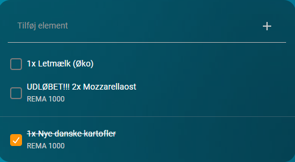

# eTilbudsavis for Home Assistant

Synkroniser dine [eTilbudsavis](https://etilbudsavis.dk) indkøbslister med Home Assistant som todo-lister.

## Sådan ser det ud

### I Home Assistant

### I eTilbudsavis-appen

## Funktioner

- **Fuld synkronisering** — varer fra eTilbudsavis-appen vises automatisk i HA inden for 60 sekunder
- **Antal** — vises som `3x Mælk` i listevisningen
- **Noter** — eTilbudsavis-noter vises i parentes: `1x Mælk (øko)` — og kan også angives fra HA
- **Butiksnavn** — tilknyttet butik vises under varen
- **Udløbne tilbud** — markeres tydeligt: `UDLØBET!!! 1x Mozzarellaost`
- **Afkrydsning** — synkroniseres øjeblikkeligt til eTilbudsavis
- **Tilføj varer** — skriv `Mælk`, `3x Mælk` eller `Mælk (øko)` for at angive antal og note
- **Omdøb og slet** — ændringer sendes øjeblikkeligt til eTilbudsavis
- **Flere lister** — synkroniser flere indkøbslister fra samme konto
- **Re-login** — automatisk ny login-dialog hvis sessionen udløber

## Installation via HACS

1. Åbn HACS i Home Assistant
2. Gå til **Integrationer** → **Brugerdefinerede repositories**
3. Tilføj `https://github.com/CagosDk/hacs-etilbudsavis` som **Integration**
4. Find og installer **eTilbudsavis**
5. Genstart Home Assistant fuldstændigt

## Opsætning

### 1. Log ind

Indtast din e-mailadresse — du modtager en 6-cifret engangskode.

### 2. Vælg lister

Vælg hvilke indkøbslister du vil synkronisere med Home Assistant.

### 3. Færdig

For at tilføje flere lister: gentag opsætningen med samme e-mailadresse.

## Brug fra Home Assistant

| Handling | Sådan gør du |
|---|---|
| Tilføj vare | Skriv `Mælk`, `3x Mælk` eller `Mælk (øko)` |
| Tilføj med antal og note | `3x Mælk (øko)` — antal og note sendes til eTilbudsavis |
| Omdøb vare | Rediger varenavnet direkte i HA |
| Rediger note | Ændr teksten i parentesen — opdateres i eTilbudsavis |
| Slet vare | Marker og slet fra HA |
| Afkryds vare | Sæt flueben — synkroniseres til eTilbudsavis |

> **Bemærk:** Butiksnavn er skrivebeskyttet — det vises i HA, men sættes kun fra eTilbudsavis-appen.

## Versionshistorik

### v1.3.0
- Noter kan nu angives fra HA som `Mælk (øko)` og gemmes i eTilbudsavis
- Noteredigering opdaterer eTilbudsavis direkte uden slet+opret

### v1.2.0
- Antal, noter og butiksnavn vises i todo-listen
- Udløbne tilbud markeres med `UDLØBET!!!`
- Antal kan angives fra HA ved at skrive `{N}x {navn}`

### v1.1.0
- Flere indkøbslister pr. konto
- Automatisk re-login når sessionen udløber
- Omdøbning af varer fra HA

### v1.0.0
- Første udgivelse

## Bemærk

Denne integration bruger eTilbudsavis' interne API og er ikke officielt støttet af Tjek/eTilbudsavis. API'et kan ændre sig uden varsel.
